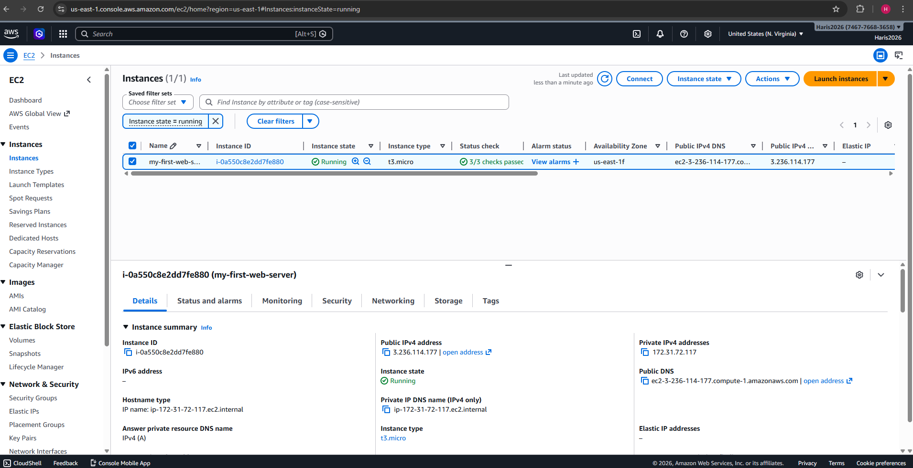
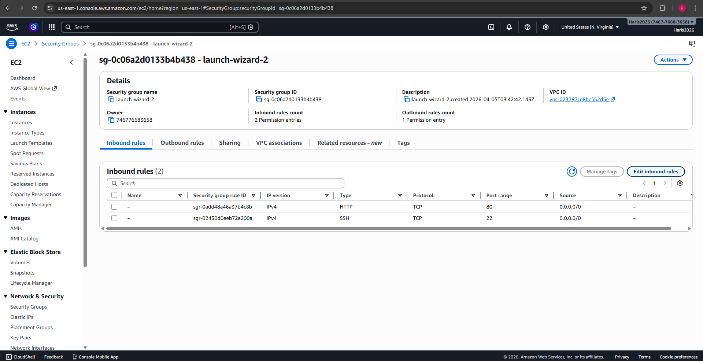
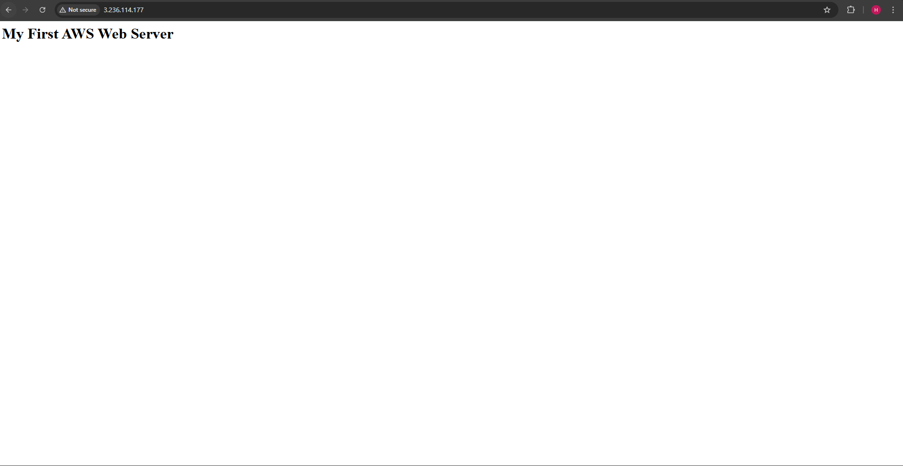
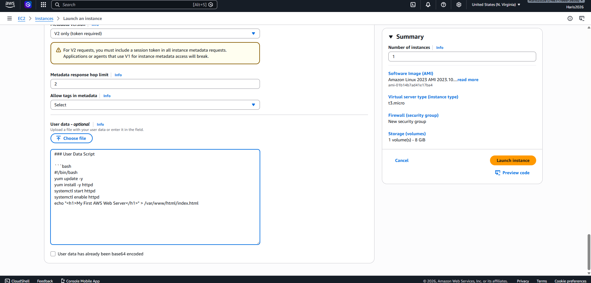

# EC2 Web Server Project

## Overview
In this project, I deployed a basic web server on AWS using an EC2 instance.

---

## EC2 Instance Running

An EC2 instance was launched using Amazon Linux.

The instance is in a running state and has been assigned a public IPv4 address, allowing it to be accessed from the internet.

---

## Security Group Configuration

A security group was created and attached to the EC2 instance to control network access.

Inbound rules were configured to allow:
- SSH (port 22) for secure remote access
- HTTP (port 80) for web traffic

This ensures that the server is accessible via a browser while maintaining controlled access.

---

## Web Server Output

The EC2 instance successfully hosts a web server.

By accessing the public IP address in a browser, the configured web page is displayed, confirming that the server is running and accessible from the internet.

---

## User Data Automation

User data was used to automate the setup of the web server during instance launch.

The script installs Apache, starts the service, and creates a basic web page automatically, removing the need for manual configuration.

---

## Key Concepts Demonstrated

- EC2 instance deployment
- Security group configuration (ports 22 and 80)
- Web server hosting using Apache
- Automation using user data scripts
- Public IP access over HTTP

---

## Tools Used

- AWS EC2
- Amazon Linux
- Security Groups
- Bash scripting
