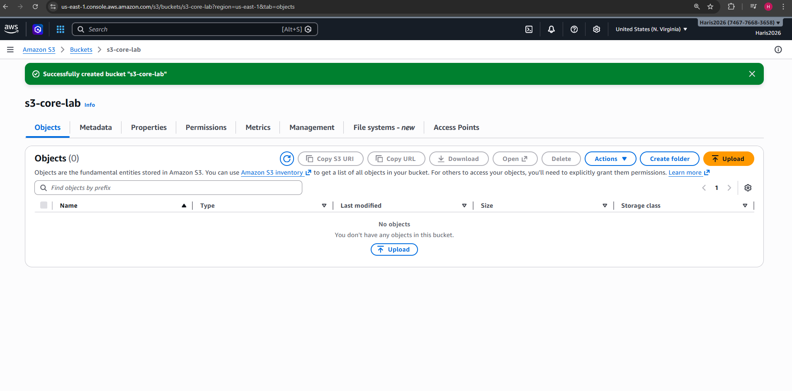
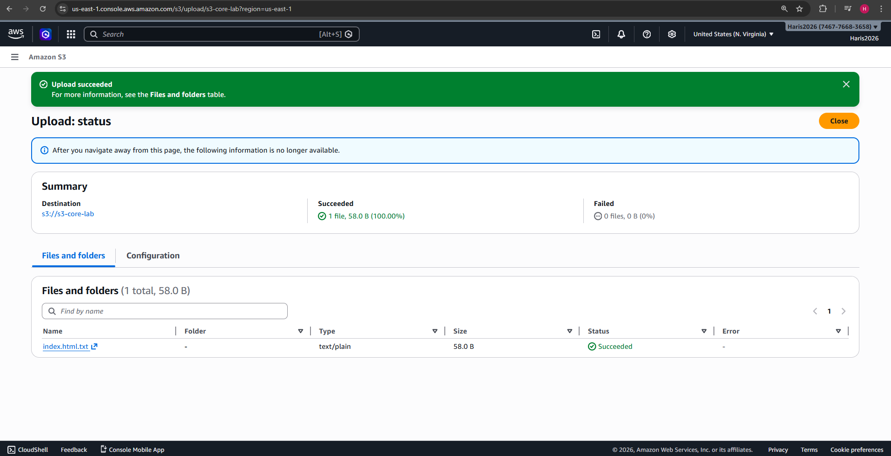
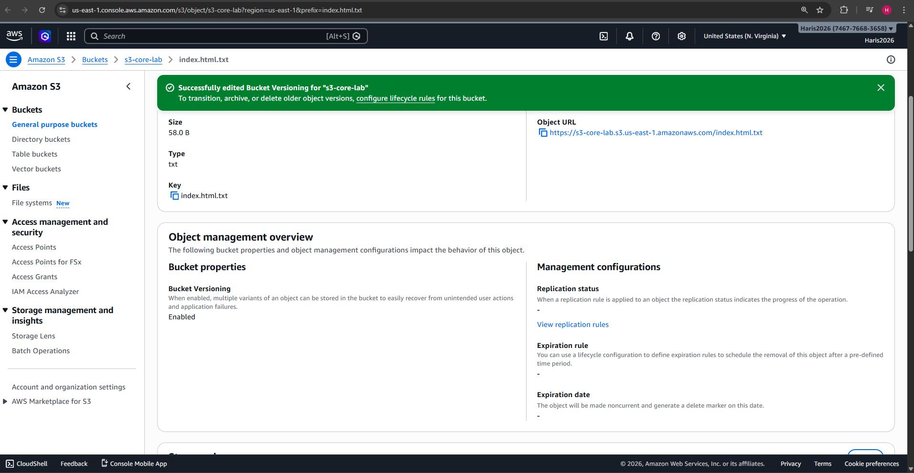
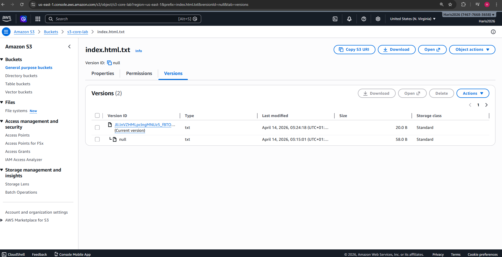
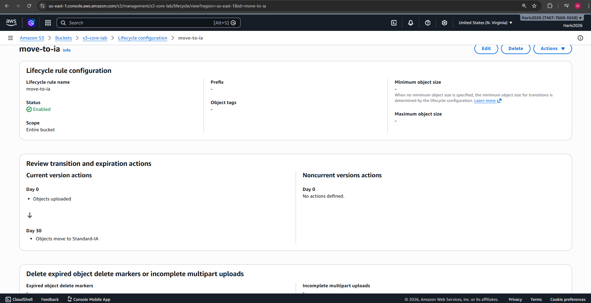
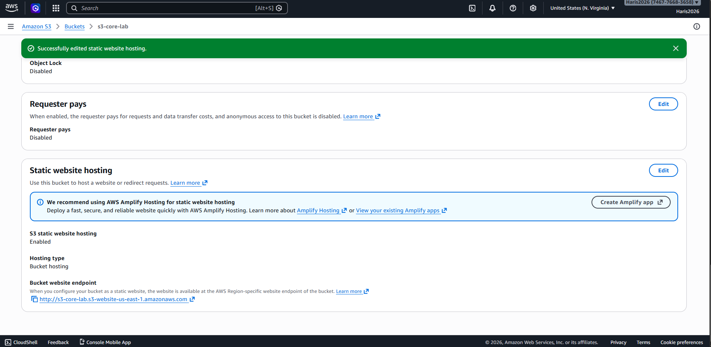
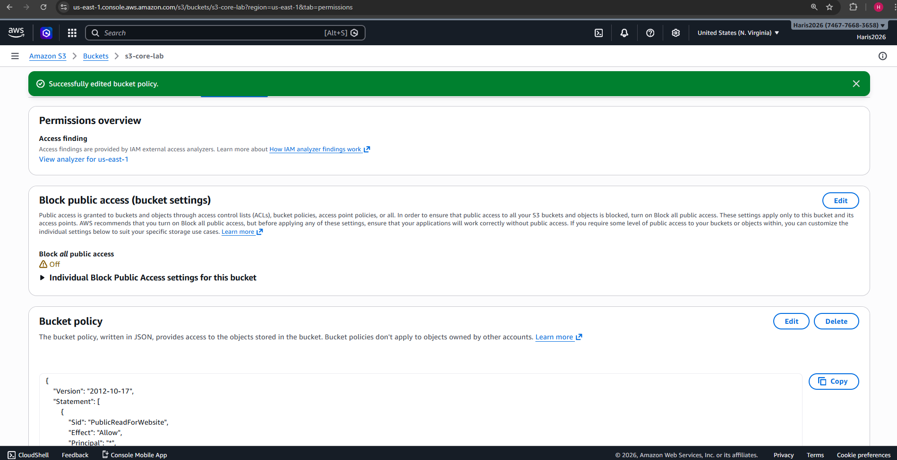
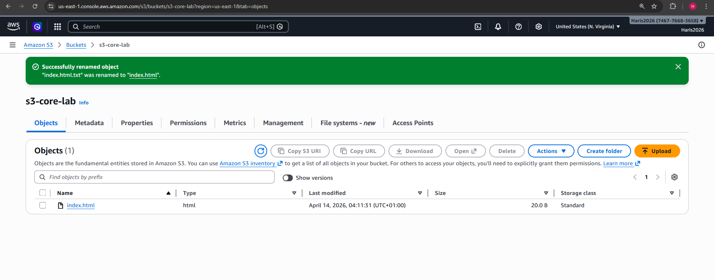
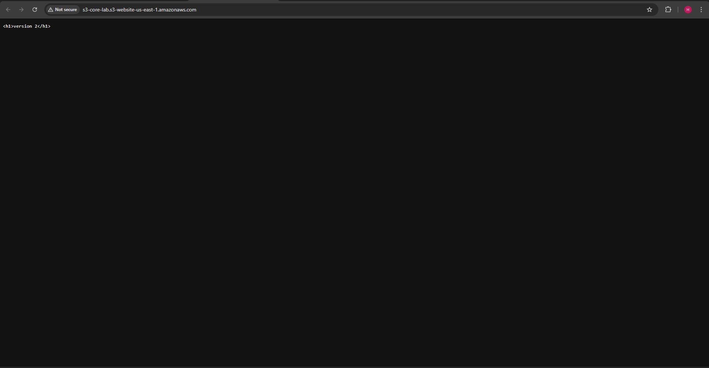

# AWS S3 Core Lab

## Overview
This project demonstrates core Amazon S3 functionality through a hands-on lab. I created an S3 bucket, uploaded objects, enabled versioning, configured a lifecycle rule, enabled static website hosting, and applied a bucket policy to allow public access to the website.

This lab helped me understand how S3 stores objects, manages versions, automates storage transitions, and serves static website content.

---

## Step 1 — Bucket Created

I created a new Amazon S3 bucket to act as the container for my objects and website files.

**What I did**
- Created an S3 bucket with a globally unique name
- Kept default settings initially, including block public access

**What I learned**
- S3 stores data inside buckets
- Bucket names must be globally unique
- Buckets are the top-level container for S3 objects

---

## Step 2 — File Uploaded

I uploaded an `index.html` file into the bucket to use as the main object for testing and static website hosting.

**What I did**
- Created and uploaded an `index.html` file
- Confirmed the file appeared in the bucket object list

**What I learned**
- Files stored in S3 are called objects
- Uploading a file to S3 creates an object in the bucket
- Object names are important when configuring website hosting

---

## Step 3 — Versioning Enabled

I enabled versioning on the bucket so that changes to files would create new versions rather than overwriting existing data.

**What I did**
- Enabled bucket versioning in the Properties tab

**What I learned**
- Versioning protects against accidental overwrites and deletions
- S3 can keep multiple versions of the same object
- Versioning is useful for recovery and auditability

---

## Step 4 — Versioning Tested

I uploaded an updated version of the same file and confirmed that S3 stored multiple versions.

**What I did**
- Modified the `index.html` file
- Re-uploaded it with the same object name
- Used “Show versions” to confirm multiple versions existed

**What I learned**
- Updating an object can create a new version instead of replacing the old one
- Older versions remain available when versioning is enabled
- S3 versioning supports data recovery and rollback

---

## Step 5 — Lifecycle Rule Created

I created a lifecycle rule to automatically transition objects to a cheaper storage class after a set period.

**What I did**
- Created a lifecycle rule
- Configured objects to transition to Standard-IA after 30 days

**What I learned**
- Lifecycle rules help automate storage cost optimisation
- S3 can move objects between storage classes without manual action
- Lifecycle management is useful for long-term cost control

---

## Step 6 — Static Website Hosting Enabled

I enabled static website hosting so the bucket could serve web content directly.

**What I did**
- Enabled static website hosting in bucket Properties
- Set `index.html` as the index document

**What I learned**
- S3 can host static websites without EC2
- Website hosting requires a valid index document
- S3 can be used for lightweight web hosting use cases

---

## Step 7 — Bucket Policy Applied

I applied a bucket policy to allow public read access to the website files.

**What I did**
- Added a bucket policy allowing `s3:GetObject`
- Applied the policy to all objects in the bucket

**What I learned**
- S3 buckets are private by default
- Bucket policies control who can access objects
- Public website hosting requires the correct permissions

---

## Step 8 — Object Name Corrected for Website Hosting

Before the website worked successfully, I identified and corrected an object naming issue so that the hosted website could load the correct file.

**What I did**
- Corrected the uploaded object name to match the website hosting configuration and bucket policy expectations
- Re-tested the website endpoint after making the correction

**What I learned**
- Static website hosting depends on the correct object name, especially the index document
- Small configuration mismatches can stop S3 website hosting from working
- Troubleshooting S3 often involves checking object names, permissions, and website settings together

---

## Step 9 — Website Working

I successfully opened the S3 website endpoint and confirmed the site was publicly accessible.

**What I did**
- Opened the static website endpoint
- Confirmed the HTML page loaded successfully in the browser

**What I learned**
- Static website hosting requires both correct configuration and correct permissions
- S3 can serve public web content directly
- End-to-end testing is important after configuration changes

---

## Skills Demonstrated

- Amazon S3 bucket creation and configuration
- Object upload and management
- S3 versioning
- Lifecycle rules
- Static website hosting
- Bucket policy configuration
- Troubleshooting S3 website access issues

---

## Outcome

Successfully built an S3 core lab that demonstrates storage, versioning, lifecycle management, access control, and static website hosting in Amazon S3.
