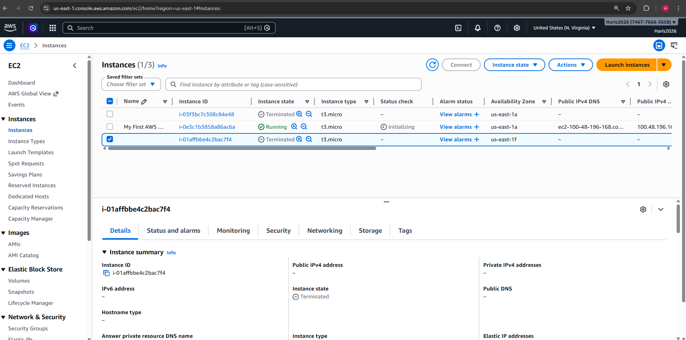
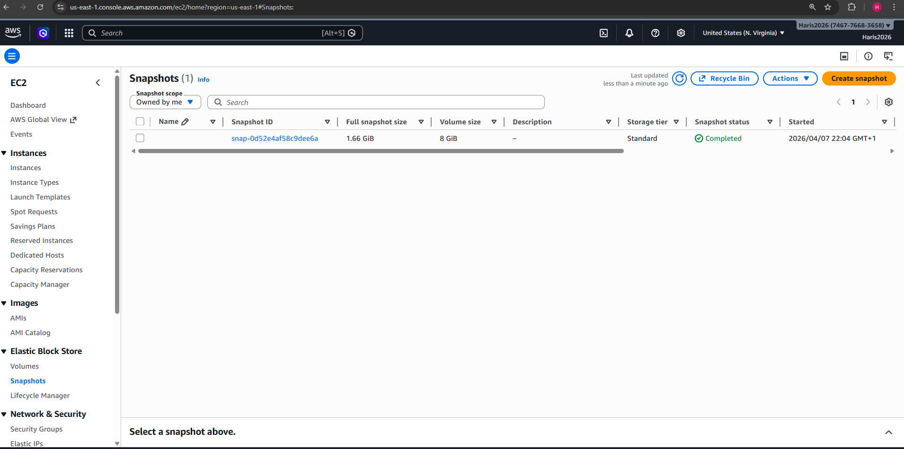
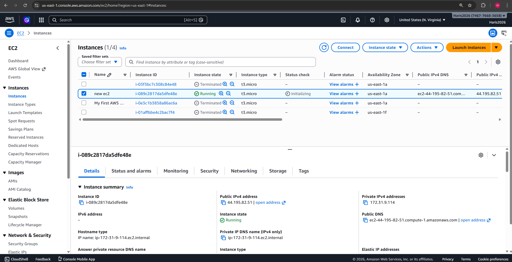
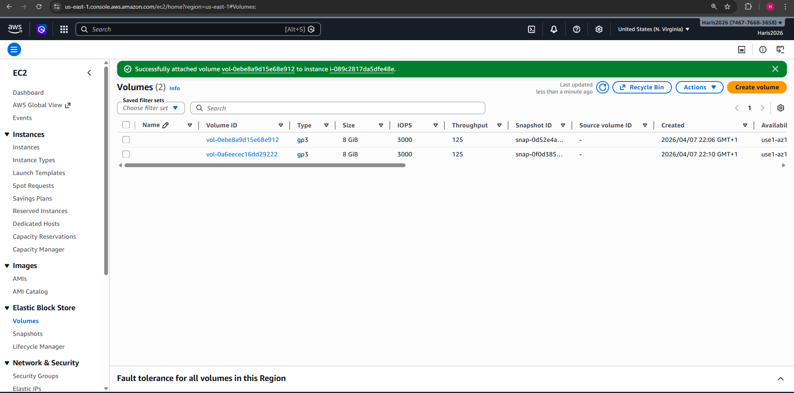
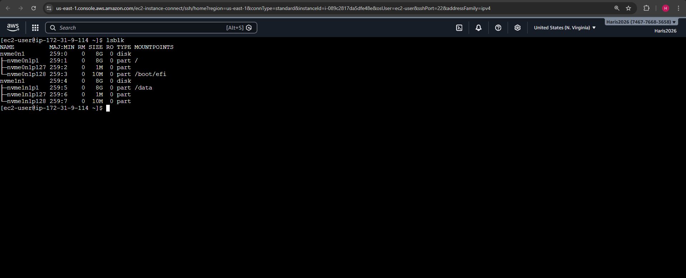
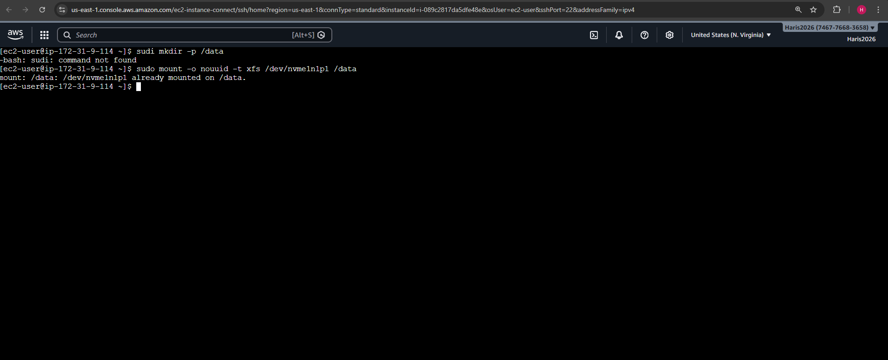
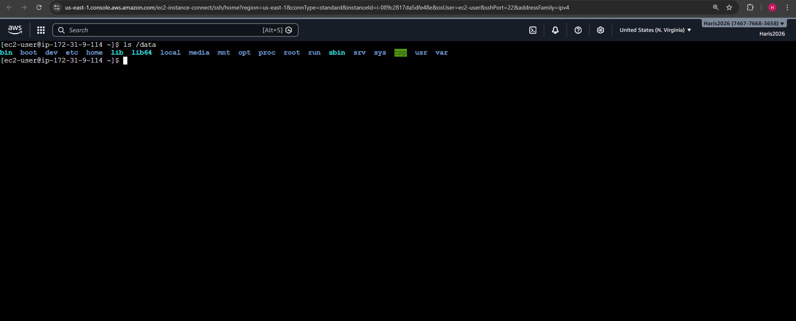

# AWS EC2 Backup & Restore using EBS Snapshots

## Overview
This project demonstrates how to back up and restore an EC2 instance using EBS snapshots.

---

## Step 1 — EC2 Instance Running

The EC2 instance was launched and running successfully.

---

## Step 2 — Snapshot Created

A snapshot of the EBS volume was created.

---

## Step 3 — New EC2 Instance

A new EC2 instance was launched in the same Availability Zone.

---

## Step 4 — Volume Attached

The restored volume was attached to the new EC2 instance.

---

## Step 5 — Disk Check

The volume was detected using the lsblk command.

---

## Step 6 — Volume Mounted

The volume was mounted using the correct filesystem.

---

## Step 7 — Data Recovered

The original data was successfully recovered.
